# MoeGirls Project 合约调用流程文档

## 版本信息
- 版本: 2.0
- 更新日期: 2025-01-XX
- 架构: VestingWalletFactory + 阶段解锁

## 系统架构总览

```mermaid
graph TB
    subgraph "Actors"
        Player[玩家 Player]
        Backend[后端 Backend]
        Treasury[Treasury EOA]
    end

    subgraph "Smart Contracts"
        MOE[MOEToken<br/>ERC20 + Permit]
        Deposit[DepositContract<br/>充值合约]
        Factory[VestingWalletFactory<br/>创建Vesting]
        VW1[VestingWallet 1]
        VW2[VestingWallet 2]
        VWN[VestingWallet N]
    end

    Player -->|1. 充值| Deposit
    Deposit -->|MOE转账| Treasury

    Player -->|2. 请求提现| Backend
    Backend -->|createVesting| Factory
    Factory -->|mint MOE| MOE
    Factory -->|创建并转账| VW1
    Factory -->|创建并转账| VW2
    Factory -->|创建并转账| VWN

    Player -->|3. 领取| VW1
    VW1 -->|MOE转账| Player

    style MOE fill:#f9f,stroke:#333,stroke-width:2px
    style Factory fill:#bbf,stroke:#333,stroke-width:2px
    style Deposit fill:#bfb,stroke:#333,stroke-width:2px
```

## 核心合约


---

## Flow 1: 部署合约（一次性）

```mermaid
sequenceDiagram
    participant Deployer
    participant MOEToken
    participant Factory as VestingWalletFactory
    participant Deposit as DepositContract

    Deployer->>MOEToken: deploy(owner)
    activate MOEToken
    MOEToken-->>Deployer: moeToken address
    deactivate MOEToken

    Deployer->>Factory: deploy(moeToken, owner)
    activate Factory
    Factory-->>Deployer: factory address
    deactivate Factory

    Deployer->>Deposit: deploy(moeToken, treasury)
    activate Deposit
    Deposit-->>Deployer: depositContract address
    deactivate Deposit

    Note over Deployer: 部署完成<br/>记录所有地址
```

### 部署参数

| 合约 | 参数 | 说明 |
|------|------|------|
| MOEToken | `initialOwner` | Backend 地址 |
| VestingWalletFactory | `_moeToken, initialOwner` | MOEToken地址, Backend地址 |
| DepositContract | `_moeToken, _treasury` | MOEToken地址, 收款EOA地址 |

---

## Flow 2: 玩家充值（Deposit - Gasless）

```mermaid
sequenceDiagram
    participant Player
    participant Frontend
    participant Backend
    participant Deposit as DepositContract
    participant MOE as MOEToken
    participant Treasury

    Note over Player,Frontend: Phase 1: Off-chain 签名
    Player->>Frontend: 发起充值请求<br/>amount: 100 MOE

    Frontend->>Frontend: 构造 EIP-2612 Permit
    Note over Frontend: domain = MOEToken<br/>spender = DepositContract<br/>amount = 100 MOE

    Frontend->>Player: 请求签名
    Player->>Frontend: 签名 permit<br/>(v, r, s)
    Note over Player: Gas: 0 ✓

    Note over Frontend,Backend: Phase 2: Backend 执行
    Frontend->>Backend: 发送签名数据<br/>{player, amount, deadline, v, r, s}

    Backend->>Deposit: depositWithPermit(player, 100 MOE, deadline, v, r, s)
    activate Deposit

    Deposit->>MOE: permit(player, Deposit, 100 MOE, deadline, v, r, s)
    activate MOE
    MOE->>MOE: 验证签名 ✓
    MOE->>MOE: approve(Deposit, 100 MOE)
    MOE-->>Deposit: 批准成功
    deactivate MOE

    Deposit->>MOE: transferFrom(player, treasury, 100 MOE)
    activate MOE
    MOE->>MOE: player.balance -= 100
    MOE->>MOE: treasury.balance += 100
    MOE-->>Deposit: 转账成功
    deactivate MOE

    Deposit->>Deposit: 记录充值信息<br/>deposits.push(...)
    Deposit->>Deposit: emit DepositMade(player, 100 MOE, ...)

    Deposit-->>Backend: 交易成功
    deactivate Deposit

    Backend-->>Frontend: 充值确认
    Frontend-->>Player: 充值完成！

    Note over Backend: Gas 消耗: ~80,000<br/>由 Backend 支付 ✓
```

### ERC-2612 Permit 签名结构


---

## Flow 3: 玩家提现（Withdrawal）

```mermaid
sequenceDiagram
    participant Player
    participant Backend
    participant Factory as VestingWalletFactory
    participant MOE as MOEToken
    participant VW as VestingWallet

    Player->>Backend: 请求提现<br/>amount: 50 MOE

    Backend->>Backend: 验证业务逻辑<br/>- 检查游戏内余额<br/>- 检查提现限额<br/>- 防重放检查

    Note over Backend: 验证通过 ✓

    Backend->>Factory: createVesting(player, 50 MOE)
    activate Factory

    Note over Factory: Step 1: Mint MOE
    Factory->>MOE: mint(factory, 50 MOE)
    activate MOE
    MOE->>MOE: totalSupply += 50
    MOE->>MOE: factory.balance += 50
    MOE->>MOE: emit MOEMinted(factory, 50)
    MOE-->>Factory: Mint 成功
    deactivate MOE

    Note over Factory: Step 2: 创建 VestingWallet
    Factory->>VW: new StageBasedVestingWallet(player, now)
    activate VW
    VW->>VW: owner = player
    VW->>VW: start = block.timestamp
    VW->>VW: duration = 120
    VW-->>Factory: wallet address
    deactivate VW

    Note over Factory: Step 3: 转账 MOE
    Factory->>MOE: transfer(VestingWallet, 50 MOE)
    activate MOE
    MOE->>MOE: factory.balance -= 50
    MOE->>MOE: VW.balance += 50
    MOE-->>Factory: 转账成功
    deactivate MOE

    Note over Factory: Step 4: 记录信息
    Factory->>Factory: playerVestingWallets[player].push(VW)
    Factory->>Factory: allVestingWallets.push(VW)
    Factory->>Factory: emit VestingCreated(player, VW, 50, now)

    Factory-->>Backend: VestingWallet address
    deactivate Factory

    Backend-->>Player: 提现创建成功<br/>VestingWallet: 0x...

    Note over Player,VW: 现在玩家可以开始领取<br/>按 30/60/90/120 秒阶段解锁

    rect rgb(200, 220, 250)
        Note over Backend: Gas 消耗: ~200,000<br/>由 Backend 支付 ✓
    end
```

### Vesting 创建状态变化

```mermaid
stateDiagram-v2
    [*] --> ValidateRequest: Backend 收到提现请求
    ValidateRequest --> MintMOE: 验证通过
    ValidateRequest --> [*]: 验证失败

    MintMOE --> DeployVestingWallet: totalSupply += amount
    DeployVestingWallet --> TransferMOE: new VestingWallet(player)
    TransferMOE --> RecordInfo: MOE → VestingWallet
    RecordInfo --> EmitEvent: 更新映射
    EmitEvent --> [*]: VestingCreated

    note right of MintMOE
        mint(factory, amount)
        factory.balance += amount
    end note

    note right of TransferMOE
        transfer(vestingWallet, amount)
        factory.balance -= amount
        vestingWallet.balance += amount
    end note
```

---

## Flow 4: 玩家领取代币（Claim）

### 阶段解锁时间表

```mermaid
gantt
    title 50 MOE 阶段解锁时间表
    dateFormat X
    axisFormat %Ss

    section 阶段 1 (25%)
    0 MOE 可领取    :0, 30
    12.5 MOE 解锁   :milestone, 30, 0

    section 阶段 2 (50%)
    12.5 MOE 可领取 :30, 60
    25 MOE 解锁     :milestone, 60, 0

    section 阶段 3 (75%)
    25 MOE 可领取   :60, 90
    37.5 MOE 解锁   :milestone, 90, 0

    section 阶段 4 (100%)
    37.5 MOE 可领取 :90, 120
    50 MOE 解锁     :milestone, 120, 0

    section 全部解锁
    50 MOE 可领取   :120, 150
```

### Claim 流程

```mermaid
sequenceDiagram
    participant Player
    participant VW as VestingWallet
    participant MOE as MOEToken

    Note over Player,VW: 场景：30秒后，第一次领取

    Player->>VW: 查询可领取金额<br/>releasable(moeToken)
    activate VW

    VW->>VW: elapsed = now - start = 30s
    VW->>VW: _vestingSchedule(50 MOE, now)

    Note over VW: 阶段计算:<br/>elapsed >= 30s && < 60s<br/>返回 25% = 12.5 MOE

    VW->>VW: vestedAmount = 12.5 MOE
    VW->>VW: releasable = 12.5 - released(0) = 12.5 MOE

    VW-->>Player: 12.5 MOE
    deactivate VW

    Note over Player: 确认金额，开始领取

    Player->>VW: release(moeToken)
    activate VW

    VW->>VW: amount = releasable(moeToken) = 12.5 MOE

    VW->>VW: _erc20Released[moeToken] += 12.5
    Note over VW: 记录已领取金额

    VW->>MOE: safeTransfer(player, 12.5 MOE)
    activate MOE
    MOE->>MOE: VW.balance -= 12.5
    MOE->>MOE: player.balance += 12.5
    MOE-->>VW: 转账成功
    deactivate MOE

    VW->>VW: emit ERC20Released(moeToken, 12.5)

    VW-->>Player: 领取成功
    deactivate VW

    Note over Player: 收到 12.5 MOE ✓<br/>Gas 消耗: ~50,000
```

### 阶段解锁算法

```mermaid
flowchart TD
    Start([开始: _vestingSchedule]) --> CheckStart{timestamp < start?}

    CheckStart -->|Yes| Return0[返回 0 MOE]
    CheckStart -->|No| CalcElapsed[elapsed = timestamp - start]

    CalcElapsed --> Stage1{elapsed < 30s?}
    Stage1 -->|Yes| Return0
    Stage1 -->|No| Stage2{elapsed < 60s?}

    Stage2 -->|Yes| Return25[返回 25% = totalAllocation * 0.25]
    Stage2 -->|No| Stage3{elapsed < 90s?}

    Stage3 -->|Yes| Return50[返回 50% = totalAllocation * 0.50]
    Stage3 -->|No| Stage4{elapsed < 120s?}

    Stage4 -->|Yes| Return75[返回 75% = totalAllocation * 0.75]
    Stage4 -->|No| Return100[返回 100% = totalAllocation]

    Return0 --> End([结束])
    Return25 --> End
    Return50 --> End
    Return75 --> End
    Return100 --> End

    style Start fill:#bfb
    style End fill:#fbb
    style Return0 fill:#ddd
    style Return25 fill:#ffd
    style Return50 fill:#fda
    style Return75 fill:#faa
    style Return100 fill:#f99
```

### 多次 Claim 示例

```mermaid
sequenceDiagram
    participant Player
    participant VW as VestingWallet<br/>(50 MOE total)

    Note over Player,VW: T=0: Vesting 创建<br/>可领取: 0 MOE

    rect rgb(255, 250, 200)
        Note over Player,VW: T=30s: 第一阶段解锁 (25%)
        Player->>VW: release()
        VW-->>Player: 12.5 MOE
        Note over VW: released = 12.5<br/>剩余 = 37.5
    end

    rect rgb(255, 220, 200)
        Note over Player,VW: T=60s: 第二阶段解锁 (50%)
        Player->>VW: release()
        VW-->>Player: 12.5 MOE
        Note over VW: released = 25<br/>剩余 = 25
    end

    rect rgb(255, 190, 200)
        Note over Player,VW: T=90s: 第三阶段解锁 (75%)
        Player->>VW: release()
        VW-->>Player: 12.5 MOE
        Note over VW: released = 37.5<br/>剩余 = 12.5
    end

    rect rgb(255, 160, 200)
        Note over Player,VW: T=120s: 第四阶段解锁 (100%)
        Player->>VW: release()
        VW-->>Player: 12.5 MOE
        Note over VW: released = 50<br/>剩余 = 0
    end

    Note over Player: 全部领取完成 ✓
```

---

## 查询函数

### DepositContract 查询

```mermaid
graph LR
    subgraph "DepositContract 查询"
        Q1[getTotalDeposits] --> R1[返回总充值数]
        Q2[getDeposit index] --> R2[返回指定充值记录]
        Q3[getPlayerDepositIndices player] --> R3[返回玩家所有充值索引]
        Q4[getPlayerDeposits player] --> R4[返回玩家所有充值记录]
        Q5[getRecentDeposits count] --> R5[返回最近N条充值]
    end

    style Q1 fill:#bbf
    style Q2 fill:#bbf
    style Q3 fill:#bbf
    style Q4 fill:#bbf
    style Q5 fill:#bbf
```

### VestingWalletFactory 查询

```mermaid
graph LR
    subgraph "VestingWalletFactory 查询"
        Q1[getPlayerVestingWallets player] --> R1[返回玩家所有 VestingWallet 地址]
        Q2[getTotalVestingWallets] --> R2[返回总 VestingWallet 数量]
        Q3[playerVestingWallets player i] --> R3[返回玩家第i个 wallet 地址]
    end

    style Q1 fill:#bfb
    style Q2 fill:#bfb
    style Q3 fill:#bfb
```

### StageBasedVestingWallet 查询

```mermaid
graph TB
    subgraph "VestingWallet 查询"
        Q1[start] --> R1[开始时间]
        Q2[duration] --> R2[总时长 120s]
        Q3[end] --> R3[结束时间]
        Q4[owner] --> R4[受益人地址]
        Q5[releasable token] --> R5[当前可领取金额]
        Q6[released token] --> R6[已领取金额]
        Q7[vestedAmount token, timestamp] --> R7[指定时间点的累计解锁金额]
        Q8[getStageInfo] --> R8[阶段时间和百分比数组]
    end

    style Q1 fill:#fbb
    style Q2 fill:#fbb
    style Q3 fill:#fbb
    style Q4 fill:#fbb
    style Q5 fill:#fda
    style Q6 fill:#fda
    style Q7 fill:#fda
    style Q8 fill:#fda
```

---

## 完整用户故事: Alice 的充值提现流程

```mermaid
sequenceDiagram
    autonumber

    participant Alice as 👤 Alice
    participant Frontend as 🖥️ 前端
    participant Backend as 🔧 Backend
    participant Deposit as 📥 DepositContract
    participant Factory as 🏭 Factory
    participant MOE as 💰 MOEToken
    participant Treasury as 🏦 Treasury
    participant VW as 📦 VestingWallet

    rect rgb(200, 250, 200)
        Note over Alice,Treasury: Phase 1: Alice 充值 100 MOE (Gasless)

        Alice->>Frontend: 发起充值 100 MOE
        Frontend->>Alice: 请求签名 permit
        Alice->>Frontend: 签名 (v, r, s)
        Frontend->>Backend: 发送签名数据
        Backend->>Deposit: depositWithPermit(Alice, 100, ...)
        Deposit->>MOE: permit & transferFrom
        MOE->>Treasury: 100 MOE
        Deposit-->>Backend: DepositMade 事件
        Backend-->>Alice: 充值成功 ✓
    end

    Note over Alice: 等待游戏内收益...

    rect rgb(200, 220, 250)
        Note over Alice,VW: Phase 2: Alice 请求提现 50 MOE

        Alice->>Backend: 请求提现 50 MOE
        Backend->>Factory: createVesting(Alice, 50)
        Factory->>MOE: mint(Factory, 50)
        Factory->>VW: 创建 VestingWallet
        Factory->>MOE: transfer(VW, 50)
        MOE->>VW: 50 MOE
        Factory-->>Backend: VW 地址
        Backend-->>Alice: 提现创建成功<br/>VW: 0x123...
    end

    Note over Alice,VW: 等待 30 秒...

    rect rgb(255, 250, 200)
        Note over Alice,VW: Phase 3: T=30s Alice 领取 25%

        Alice->>VW: releasable(MOE)?
        VW-->>Alice: 12.5 MOE
        Alice->>VW: release(MOE)
        VW->>MOE: transfer(Alice, 12.5)
        MOE->>Alice: 12.5 MOE
        VW-->>Alice: 领取成功 ✓
    end

    Note over Alice,VW: 等待 30 秒...

    rect rgb(255, 240, 200)
        Note over Alice,VW: Phase 4: T=60s Alice 领取 25%

        Alice->>VW: release(MOE)
        VW->>MOE: transfer(Alice, 12.5)
        MOE->>Alice: 12.5 MOE
        Note over Alice: 累计收到 25 MOE
    end

    Note over Alice,VW: 等待 30 秒...

    rect rgb(255, 230, 200)
        Note over Alice,VW: Phase 5: T=90s Alice 领取 25%

        Alice->>VW: release(MOE)
        VW->>MOE: transfer(Alice, 12.5)
        MOE->>Alice: 12.5 MOE
        Note over Alice: 累计收到 37.5 MOE
    end

    Note over Alice,VW: 等待 30 秒...

    rect rgb(255, 220, 200)
        Note over Alice,VW: Phase 6: T=120s Alice 领取最后 25%

        Alice->>VW: release(MOE)
        VW->>MOE: transfer(Alice, 12.5)
        MOE->>Alice: 12.5 MOE
        Note over Alice: 累计收到 50 MOE ✓<br/>提现完成！
    end
```

---

## 状态转换图

### DepositContract 状态

```mermaid
stateDiagram-v2
    [*] --> Deployed: 部署合约

    Deployed --> WaitingDeposit: 等待充值

    WaitingDeposit --> ProcessingDeposit: deposit() / depositWithPermit()
    ProcessingDeposit --> ValidatingPermit: 验证 permit 签名
    ValidatingPermit --> TransferringMOE: 签名有效
    ValidatingPermit --> WaitingDeposit: 签名无效 ❌

    TransferringMOE --> RecordingDeposit: MOE → Treasury
    RecordingDeposit --> WaitingDeposit: 记录完成 + emit event

    note right of ProcessingDeposit
        检查:
        - amount > 0
        - player 有足够余额
        - permit 签名有效
    end note
```

### VestingWallet 生命周期

```mermaid
stateDiagram-v2
    [*] --> Created: Factory 创建

    Created --> Stage0: T=0s (0% unlocked)

    Stage0 --> Stage1: T=30s
    Stage1 --> Stage2: T=60s
    Stage2 --> Stage3: T=90s
    Stage3 --> Stage4: T=120s

    Stage4 --> FullyVested: 100% unlocked

    Stage1 --> Claiming1: Player claim
    Claiming1 --> Stage1: 领取 25%

    Stage2 --> Claiming2: Player claim
    Claiming2 --> Stage2: 领取 50% (累计)

    Stage3 --> Claiming3: Player claim
    Claiming3 --> Stage3: 领取 75% (累计)

    Stage4 --> Claiming4: Player claim
    Claiming4 --> FullyVested: 领取 100%

    FullyVested --> [*]: 全部领取完毕

    note right of Stage1
        25% unlocked
        可领取: totalAmount * 0.25
    end note

    note right of Stage2
        50% unlocked
        可领取: totalAmount * 0.5 - claimed
    end note

    note right of Stage3
        75% unlocked
        可领取: totalAmount * 0.75 - claimed
    end note

    note right of Stage4
        100% unlocked
        可领取: totalAmount - claimed
    end note
```

---

## Gas 消耗估算

```mermaid
graph LR
    subgraph "部署阶段"
        D1[MOEToken<br/>~1,100,000 gas]
        D2[Factory<br/>~900,000 gas]
        D3[DepositContract<br/>~800,000 gas]
    end

    subgraph "运行阶段"
        O1[签名 permit<br/>0 gas ✓]
        O2[depositWithPermit<br/>~80,000 gas<br/>Backend 支付]
        O3[createVesting<br/>~200,000 gas<br/>Backend 支付]
        O4[release<br/>~50,000 gas<br/>Player 支付]
    end

    style O1 fill:#bfb
    style O2 fill:#fda
    style O3 fill:#fda
    style O4 fill:#fbb
```

| 操作 | Gas 消耗 | 谁支付 |
|------|---------|--------|
| 部署 MOEToken | ~1,100,000 | Deployer |
| 部署 Factory | ~900,000 | Deployer |
| 部署 DepositContract | ~800,000 | Deployer |
| 签名 permit (off-chain) | 0 | - |
| depositWithPermit | ~80,000 | Backend |
| createVesting | ~200,000 | Backend |
| release (claim) | ~50,000 | Player |

---

## 经济模型

```mermaid
graph TD
    subgraph "充值流 (Deposit)"
        P1[Player 持有 MOE] -->|签名 permit| P2[Permit 签名]
        P2 -->|Backend 调用| P3[depositWithPermit]
        P3 -->|transferFrom| P4[Treasury EOA]
    end

    subgraph "提现流 (Withdrawal)"
        W1[Backend 验证] -->|createVesting| W2[Factory]
        W2 -->|mint| W3[新的 MOE]
        W2 -->|创建| W4[VestingWallet]
        W3 -->|transfer| W4
        W4 -->|阶段解锁| W5[Player 领取]
    end

    subgraph "经济闭环"
        P4 -.可选.-> E1[Treasury 用途]
        E1 -.市场运营.-> E2[回购/销毁]
        E1 -.游戏奖励.-> E3[空投/活动]
        E3 -.玩家充值.-> P1
    end

    style P1 fill:#bfb
    style P4 fill:#fda
    style W3 fill:#fbb
    style W5 fill:#bbf
```

### 代币流向

```mermaid
sankey-beta

Player充值,Treasury,1000
Treasury,市场运营,300
Treasury,储备金,700
Backend创建,VestingWallet,800
VestingWallet,Player领取,800
市场运营,玩家奖励,300
玩家奖励,Player充值,200
```

---

## 安全特性

```mermaid
mindmap
    root((安全机制))
        ReentrancyGuard
            deposit
            depositWithPermit
            防止重入攻击
        Access Control
            onlyOwner
                MOEToken.mint
                Factory.createVesting
            只有 Backend 可执行
        Input Validation
            amount > 0
            address != 0x0
            amount % 4 == 0
            防止无效输入
        ERC-2612 Permit
            Deadline 防重放
            Nonce 防重复
            签名验证
            Gasless approval
        OpenZeppelin
            审计过的代码
            VestingWallet
            SafeERC20
            Ownable
```

---

## 与旧版对比

```mermaid
graph LR
    subgraph "旧版 v1.0"
        OldMOE[MOEToken<br/>预 mint 10M]
        OldVesting[单个 VestingContract<br/>管理所有玩家]
        OldDeposit[DepositContract<br/>→ VestingContract]
        OldEconomy[闭环经济<br/>Deposit refills pool]
        OldGasless[ERC-2771 + ERC-2612]
    end

    subgraph "新版 v2.0"
        NewMOE[MOEToken<br/>按需 mint]
        NewFactory[VestingWalletFactory<br/>每玩家独立 wallet]
        NewDeposit[DepositContract<br/>→ Treasury EOA]
        NewEconomy[开环经济<br/>Mint for withdrawal]
        NewGasless[仅 ERC-2612]
    end

    OldMOE -.升级.-> NewMOE
    OldVesting -.重构.-> NewFactory
    OldDeposit -.修改.-> NewDeposit
    OldEconomy -.调整.-> NewEconomy
    OldGasless -.简化.-> NewGasless

    style NewMOE fill:#bfb
    style NewFactory fill:#bfb
    style NewDeposit fill:#bfb
    style NewEconomy fill:#bfb
    style NewGasless fill:#bfb
```

| 特性 | 旧版 v1.0 | 新版 v2.0 |
|------|-----------|-----------|
| Vesting 实现 | 自定义 | OpenZeppelin VestingWallet ✓ |
| 多玩家支持 | 单合约管理所有 | Factory 模式，每玩家独立 wallet ✓ |
| 初始供应 | 预 mint 10M | 按需 mint ✓ |
| Deposit 目标 | VestingContract | Treasury EOA ✓ |
| 经济模型 | 闭环 | 开环 |
| Gasless | ERC-2771 + ERC-2612 | 仅 ERC-2612 |
| 合约复杂度 | 高 | 低（使用标准库）✓ |
| 安全性 | 自定义实现 | OpenZeppelin 审计过 ✓ |

---

## 部署配置

### 网络信息

```mermaid
graph LR
    subgraph "Arbitrum Sepolia"
        Net[Network Info]
        Net --> ChainID[Chain ID: 421614]
        Net --> RPC[RPC: sepolia-rollup.arbitrum.io/rpc]
        Net --> Explorer[Explorer: sepolia.arbiscan.io]
        Net --> Currency[Currency: ETH]
    end

    style Net fill:#f9f
```

### 环境变量

```bash
# .env
PRIVATE_KEY=0x...
ARBITRUM_SEPOLIA_RPC=https://sepolia-rollup.arbitrum.io/rpc
TREASURY_ADDRESS=0x...  # 收款 EOA 地址
```

### 部署流程

```mermaid
flowchart TD
    Start([开始部署]) --> CheckEnv{检查环境变量}
    CheckEnv -->|缺失| Error1[❌ 错误: 配置 .env]
    CheckEnv -->|完整| DeployMOE[部署 MOEToken]

    DeployMOE --> RecordMOE[记录 MOEToken 地址]
    RecordMOE --> DeployFactory[部署 VestingWalletFactory]
    DeployFactory --> RecordFactory[记录 Factory 地址]
    RecordFactory --> DeployDeposit[部署 DepositContract]
    DeployDeposit --> RecordDeposit[记录 DepositContract 地址]

    RecordDeposit --> Verify{是否验证合约?}
    Verify -->|Yes| VerifyContracts[npx hardhat verify]
    Verify -->|No| SaveAddresses
    VerifyContracts --> SaveAddresses[保存所有地址到文档]

    SaveAddresses --> ConfigBackend[配置 Backend]
    ConfigBackend --> End([部署完成 ✓])

    Error1 --> End

    style Start fill:#bfb
    style End fill:#fbb
    style Error1 fill:#faa
```

---

## 常见问题 (FAQ)

```mermaid
graph TB
    FAQ[常见问题]

    FAQ --> Q1[为什么不用闭环经济?]
    Q1 --> A1[Deposit到EOA便于Backend灵活使用<br/>Withdrawal从mint保证充足]

    FAQ --> Q2[Gas成本会不会太高?]
    Q2 --> A2[createVesting ~200k gas<br/>提现频率低，可接受<br/>可优化: EIP-1167 proxy]

    FAQ --> Q3[如何查询玩家的VestingWallet?]
    Q3 --> A3[factory.getPlayerVestingWallets player]

    FAQ --> Q4[一个玩家可以有多个Vesting吗?]
    Q4 --> A4[可以！每次createVesting创建新的]

    FAQ --> Q5[阶段中间可以claim吗?]
    Q5 --> A5[可以，但按前一阶段计算<br/>45秒claim只能领25%]

    FAQ --> Q6[代币会丢失吗?]
    Q6 --> A6[不会，VestingWallet无过期<br/>随时可以claim]

    FAQ --> Q7[如何防止恶意提现?]
    Q7 --> A7[Backend实施业务逻辑<br/>- 验证游戏余额<br/>- 限制频率/金额<br/>- 监控异常]

    FAQ --> Q8[Treasury地址可改吗?]
    Q8 --> A8[不可以，immutable<br/>需重新部署DepositContract]

    style FAQ fill:#f9f
    style A1 fill:#efe
    style A2 fill:#efe
    style A3 fill:#efe
    style A4 fill:#efe
    style A5 fill:#efe
    style A6 fill:#efe
    style A7 fill:#efe
    style A8 fill:#efe
```

---

## 后续优化建议

```mermaid
mindmap
    root((优化方向))
        Gas 优化
            EIP-1167 Minimal Proxy
                ~200k → ~50k gas
            批量操作
                batchCreateVesting
                一次为多人创建
        功能扩展
            自定义解锁曲线
                线性
                阶段式
                Cliff + 线性
                自定义百分比
            紧急暂停
                Pausable
                pause/unpause
        安全增强
            提现限额
                单笔限额
                每日限额
                监控预警
            多签控制
                Multisig owner
                关键操作需多签
        监控运维
            事件监听
                DepositMade
                VestingCreated
                ERC20Released
            数据分析
                充值统计
                提现统计
                Gas 消耗分析
```

---

## 文档版本历史

```mermaid
gitGraph
    commit id: "v1.0 初版" tag: "v1.0"
    commit id: "闭环经济 + 预mint"
    commit id: "ERC-2771 + ERC-2612"
    branch v2-redesign
    checkout v2-redesign
    commit id: "调研 OpenZeppelin VestingWallet"
    commit id: "设计 Factory 模式"
    commit id: "重构 DepositContract"
    checkout main
    merge v2-redesign tag: "v2.0"
    commit id: "v2.0 发布"
    commit id: "按需mint + VestingWalletFactory"
    commit id: "阶段解锁 + Treasury EOA"
```

| 版本 | 日期 | 变更说明 |
|------|------|---------|
| 2.0 | 2025-01-XX | 完全重构：VestingWalletFactory + 阶段解锁 + 按需mint |
| 1.0 | 2025-01-XX | 初版：闭环经济 + 预mint + 自定义vesting |

---

**文档结束**
